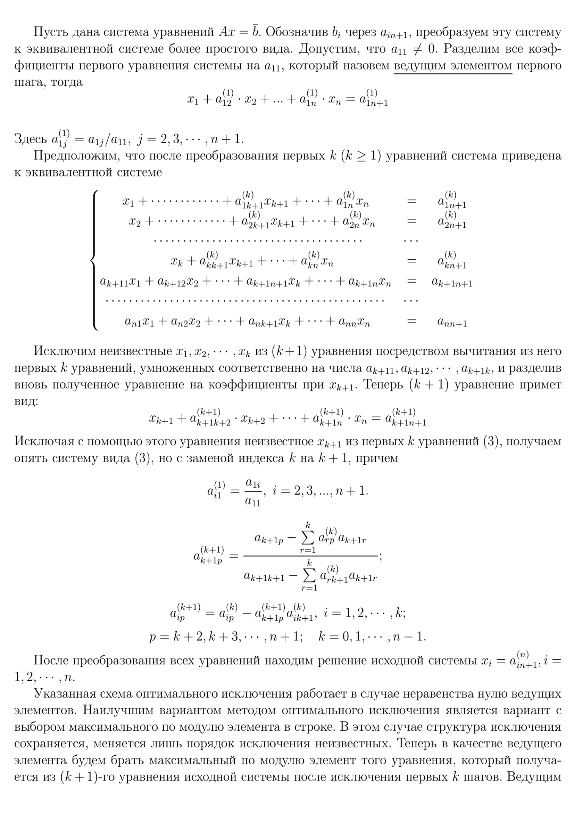
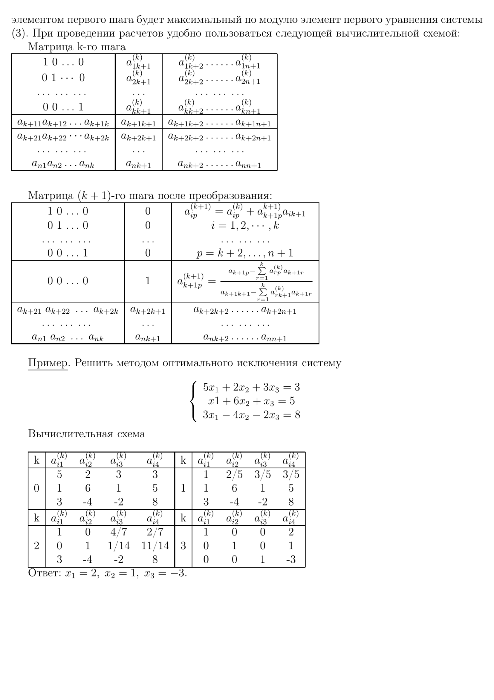

**Лабораторная работа №3** \
Метод оптимального исключения
=====================================================
>*Выполнил студент Гринёв Максим Б9119-01.03.
02миопд*. {{Date}}

## Постановка задачи

!!!include(components/formulation.md)!!!

 
 
 

## Алгоритм

 
 

!!!include(components/code.md)!!!

 
 

## Тесты

 
 

!!!include(components/tests.md)!!!

 
 
 

## Заключение

 

!!!include(components/conclusion.md)!!!

